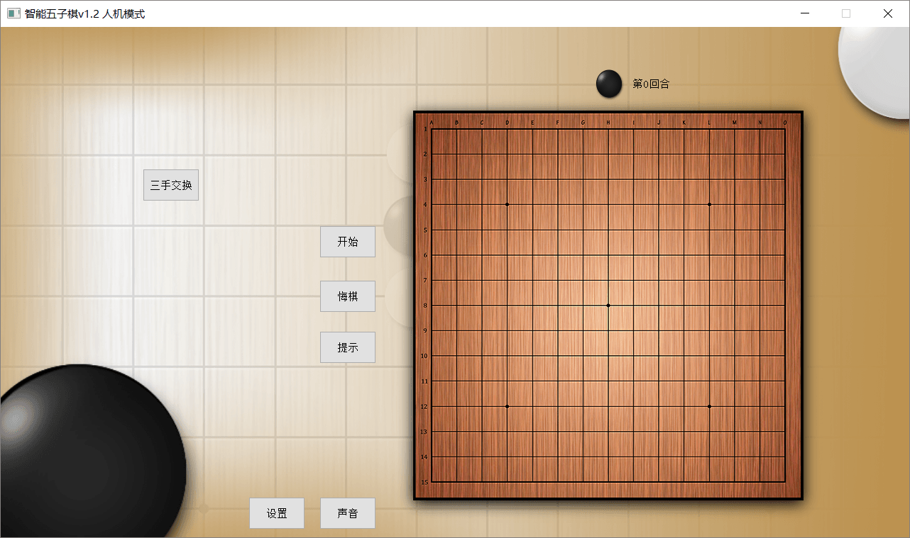
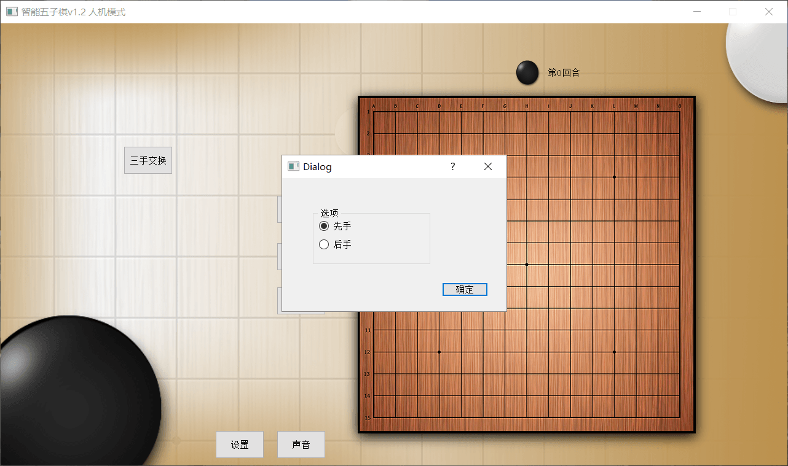
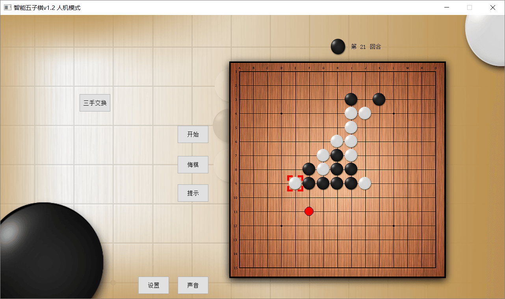
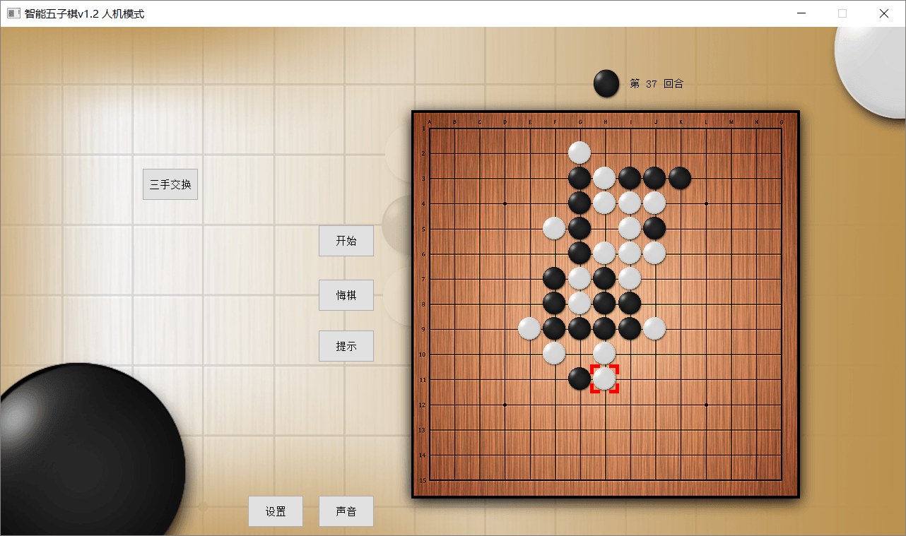
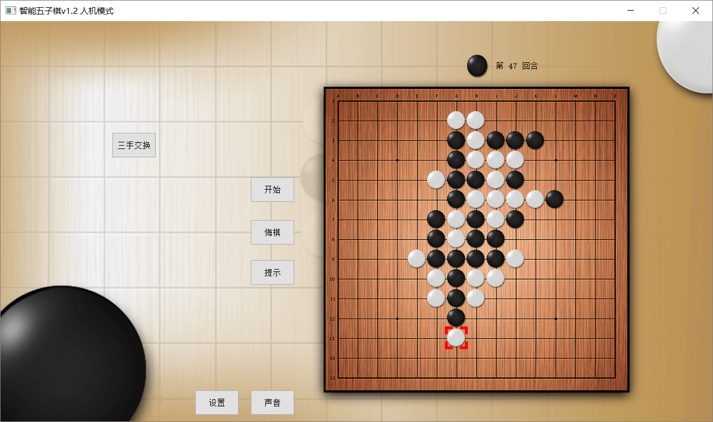
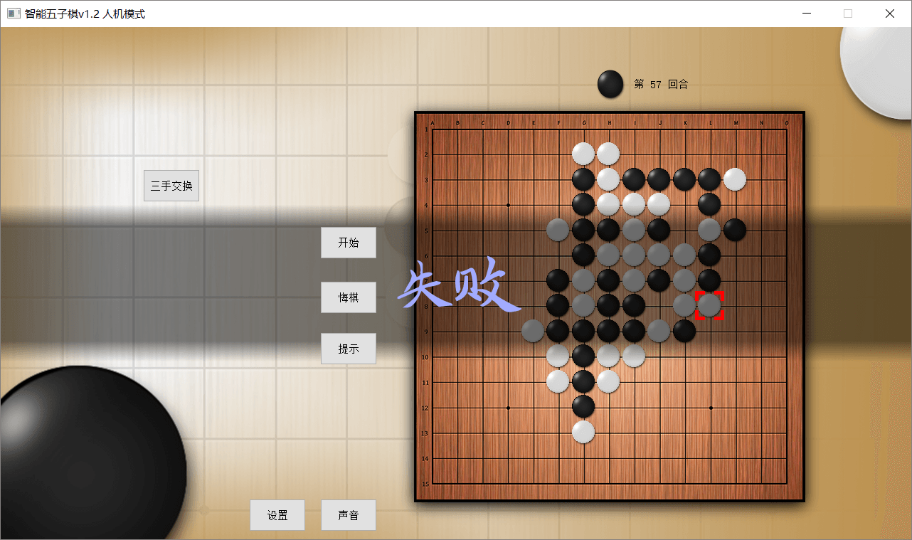

# 单机五子棋

#### 介绍
本项目为学习与研究项目，通过设计与实现一个单机五子棋游戏，体会算法的设计与分析过程，增强对于算法的学习能力，提高使用算法解决实际问题的能力。主要功能包括选择先后手、三手交换、五子棋禁手的判断、保存棋盘记录、判断胜负输赢、悔棋等。

#### 截图

#### 技术栈
C++、Qt

1. 使用启发式搜索和负极大值 alpha_beta 剪枝博弈搜索算法对棋盘进行搜索
2. GUI 界面采用基于 C++ 的 Qt 框架进行开发

#### 功能特性

1. 开发的界面为 15x15 规格的棋盘界面
2. 实现禁手规则以及指定开局和三手交换
3. 完成可对每种局面进行打分的评分函数
4. 三三禁手和四四禁手的棋子位置自动标红
5. 能够对棋局的胜负输赢进行准确判断

#### 使用说明

1. 此项目为 Qt 项目，需配置 Qt 环境，并且使用 Qt Creator 才能正常运行
2. 如需打包发布，则应先在 Qt Creator 中构建 Release 版的 FiveChess.exe 可执行文件，然后使用 windeployqt FiveChess.exe 命令生成 Qt 依赖运行库
